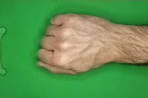
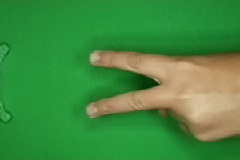
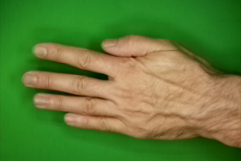
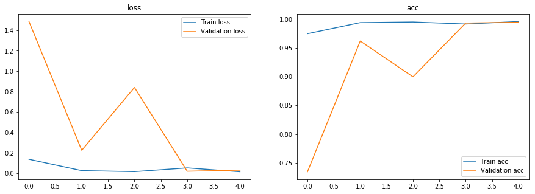

    

# Rock Paper Scissors Keras Image Classification
### In this project I use the a dataset on kaggle that has pictures of human hands playing rock paper scissors. I use Keras with TensorFlow along with data augmentation and Keras ImageDataGenerator for image preprocessing to obtain an accuracy of 99%. 

# Dataset:
### https://www.kaggle.com/drgfreeman/rockpaperscissors
### This dataset contains images of hand gestures from the Rock-Paper-Scissors game. The images were captured as part of a hobby project where I developped a Rock-Paper-Scissors game using computer vision and machine learning on the Raspberry Pi.

# Project Page
### https://github.com/DrGFreeman/rps-cv

